## 前言

> 此次教程演示的开发环境所使用的平台为：`Windows 11`。`Linux`和`Mac`用户也可以学习搭建流程。
---
> 纯净版本教程，可以直接跳到软件下载环节。
---
> 我个人比较喜欢使用`VSCode`，所以在大概摸清了这款单片机的开发流程后（点了个灯，点了屏幕。），就希望将整个工具链迁移到`VSCode`里，所幸的是，借助之前积累的一些经验，这一次的迁移工作很顺利。

---

---

2024年12月份，购入了这块`HPM5301evk_lite`开发板。想要进一步学习国产开发板和`RISCV`芯片，但是当时连烧录程序都做不到，一直以为是技术力不够（确实，时至今日，技术力也没有提升。。。），就将其搁置了，直到前几天，在`VX`群里，有群友问起关于`HPM`单片机的一些问题，于是打算好好琢磨一下这块板子，将其利用起来，顺便将自己遇到的问题记录下来，方便想要学习`HPMicro`单片机的群友/观众/网友们。

---

---

## 硬件准备

- 一块`HPM`开发板。
  - 对于入门学习，最好是先购买官方的评估板。 
- 一个调试器，这是个最大的坑！！！
  - 不方便直接推荐，但是建议购买前先询问客服，是否支持调试`HPM`单片机。
  - 如果你只有`Jlink`，确保其固件版本至少为`V12`。
    - 其实我也不太确定具体的固件版本，但是我手里的`V9`版本均无法完成烧录和调试。
  - 如果你只有`DAP-Link`，确保其固件支持`JTAG`协议。
    - 一些廉价`DAP-Link`不支持`JTAG`。
- 若干杜邦线。
- 一个`USB-TTL`调试器。
  - 部分`Jlink`和`DAP-Link`会有串口支持。

## 软件下载

本次教程演示所需的软件/工具列举在下方，直接点击，即可跳转。

> 开始配置之前，确保你的网络可以流畅访问`GitHub`。

- [VSCode](https://code.visualstudio.com/download#)
  - 代码编写软件，经过配置之后，可以成为你想要的`IDE`。
- [HPM_sdk_env](https://github.com/hpmicro/sdk_env)
  - 对于学习过`STM32`单片机的同学，可以将其类似理解成`STM32CubeMX`，`sdk`表明这个压缩包里含有驱动以及例程，`env`表明这个压缩包里会附带开发的必要工具/工具链。以上是我的浅显理解，仅供参考。
- [ninja](https://github.com/ninja-build/ninja/releases)
  - 用于编译工程，虽然会`HPM_sdk_env`的工具里附带了，但如果将其添加到环境变量又会显得不太协调，所以这里单独下载一个，添加到环境变量即可，文档里不做详细说明，视频会演示如何添加环境变量。这里仅给出我的一个解决办法，聪明的你一定还有更优雅的解决方案。

---

## 开始配置

1. 解压`sdk_env`，放到一个相对稳定的位置即可，这个`sdk-env`更新频率不高，不需要经常更改。

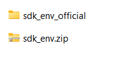

如图，我解压之后将其重命名为`sdk_env_official`，方便辨识，并且表明这是官方`sdk`，我不会在这个文件里做任何更改，方便之后开发的时候快速排除和定位问题，以及复现问题。

2. 在同级目录下新建一个目录，用于存放自己的工程，推荐尽量不要去更改`sdk_env`里的内容。

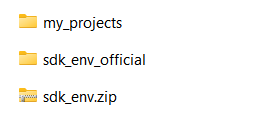

如图，我将其命名为`my_projects`。

3. 初探`sdk_env`，介绍相关功能。

完成了以上两个步骤之后，可以打开`sdk_env_official`（从`sdk_env.zip`解压得到）里的`start_gui.exe`，开始熟悉一下这个工具，下图是初次启动的默认界面。

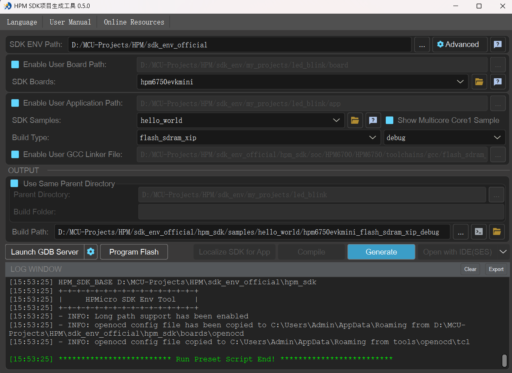

需要配置的只有四个蓝色复选框的内容，根据字面意思也很容易理解其相关功能。文档只做大概的介绍，视频会详细演示。

- `Enable User Board Path`
  - 勾选之后可以使用自定义的板子，教程里需要勾选。
- `Enable User Application Path`
  - 勾选后可以使用自定义的应用入口，教程里需要勾选。
- `Enable User GCC Linker File`
  - 勾选后可以使用自定义的链接器，一般来说，默认即可，不需要勾选。
- `Use Same Parent Directory`
  - 勾选后可以将配置好的工程输出到与`Board`和`APP`相同的根（父）目录下，教程里需要勾选。

这里先给出一个配置完成的截图，如下图所示，之后的所有教程（如果有希望继续出教程的话）都会使用这个配置模板。

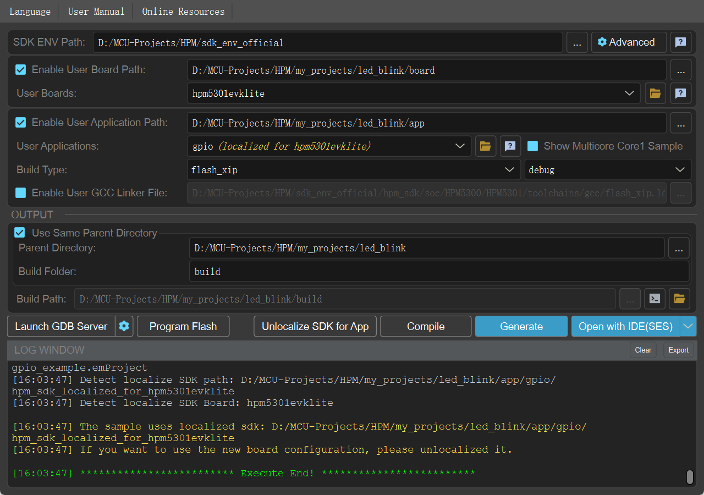

4. 创建工程，配置模板。

教程以`gpio`作为演示，在之前的`my_projects`里创建一个目录，命名为`led_blink`，进入`led_blink`，在该目录里创建两个目录，分别为`app`和`board`，大小写随便，命名方式按照你的喜好即可，但是**不要留空格**，也**不要用中文还有特殊字符**。

```bash
# 这是工程目录
led_blink
  app
  board
```

接下来就是从`sdk_env_official`里复制所需文件即可，文字描述可能不够直观，这一段的末尾会提供一个移植好的工程目录结构，进行参考即可。

Step_1：从`D:\MCU-Projects\HPM\sdk_env_official\hpm_sdk\samples\drivers`目录，复制`gpio`目录，放到`D:\MCU-Projects\HPM\my_projects\led_blink\app`里。

Step_2：从`D:\MCU-Projects\HPM\sdk_env_official\hpm_sdk\boards`目录，复制`hpm5301evklite`目录，放到`D:\MCU-Projects\HPM\my_projects\led_blink\board`里。

Step_3：从`D:\MCU-Projects\HPM\sdk_env_official\hpm_sdk\boards`目录，复制`openocd`目录，放到`D:\MCU-Projects\HPM\my_projects\led_blink\board`里。

Step_4：在`D:\MCU-Projects\HPM\my_projects\led_blink\board\openocd`里新建一个`bin`目录。

Step_5：从`D:\MCU-Projects\HPM\sdk_env_official\tools\openocd`目录，复制目录下所有的内容，包含一个`tcl`目录和`openocd.exe`文件，放到`D:\MCU-Projects\HPM\my_projects\led_blink\board\openocd\bin`目录。

完成以上5个步骤，你的工程目录应该类似这样：

```bash
led_blink
  app
    gpio
  board
    hpm5301evklite
    openocd
      bin
      boards
      probes
      soc
      hpm5e00_all_in_one.cfg
      ...
      hpm6800_all_in_one.cfg
```

> 说实话，我还是推荐观看视频，文字描述可能已经够详细了，但还是不够直观，实际操作更符合直觉。

Step_6：在`sdk_env_official`里打开`start_gui.exe`，开始对以上的模板工程进行配置。

Step_7：直接看图操作吧，这一步推荐看视频演示，若是跟不上视频操作，就对照文字和图片。

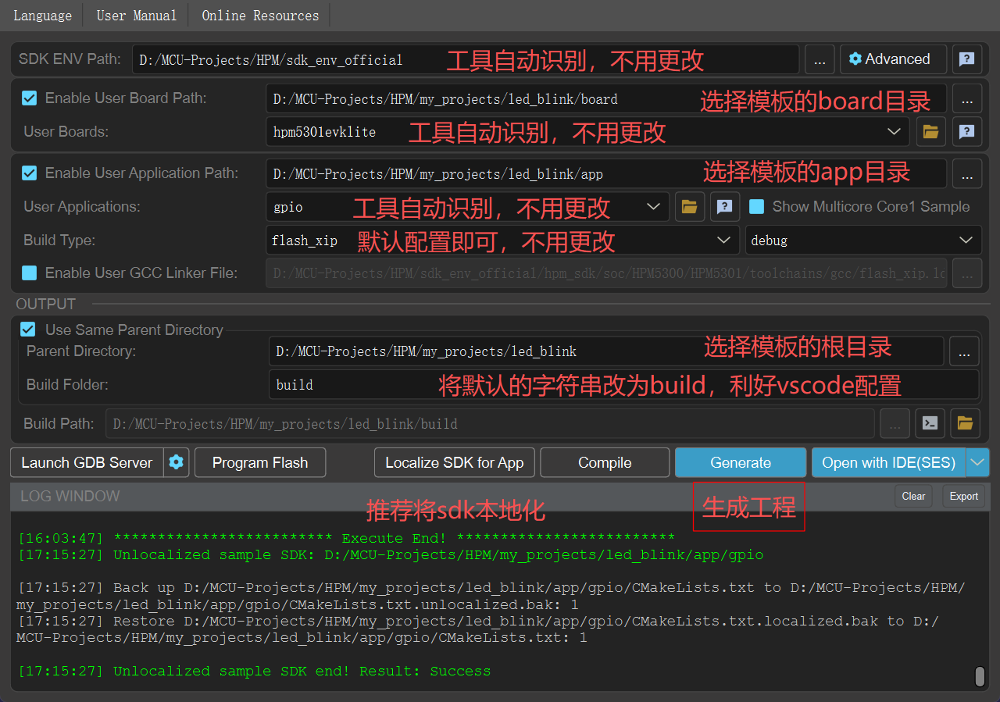
---

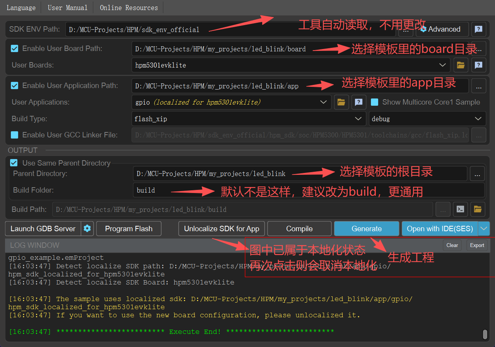
---

Step_8：在`D:\MCU-Projects\HPM\my_projects\led_blink\board\openocd\soc`目录里，找到`hpm5300.cfg`复制一份，改名为`hpm5301.cfg`，并且使用任何文本编辑器打开`hpm5300.cfg`。

找到配置文件里的`set _CHIP hpm5300`将其更改为`set _CHIP hpm5301`即可。

完成以上8个步骤，就得到了一份完整的工程，接下来的步骤会介绍如何配置`VSCode`，进行代码编写、代码跳转、代码编译、代码烧录、代码调试。其中的一部分配置文件需要按照自己的环境填写相应的路径。

Step_9：打开`VSCode`，新建一个`Profile`，用于`HPM`单片机开发。

> 推荐新建一个`Profile`用于新的开发环境，虽然这些插件最后都是存在`C`盘，但是做一个分类，会显得有条理一些。

- `VSCode`启动页，找到右上角的设置，点击。
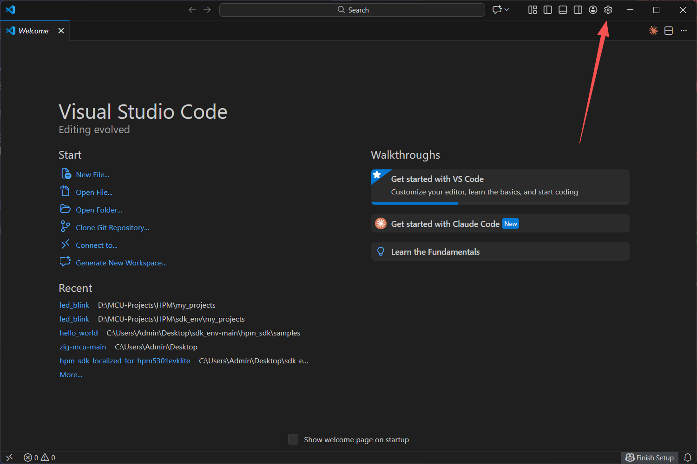
---

- 点击`Profile`，进入。
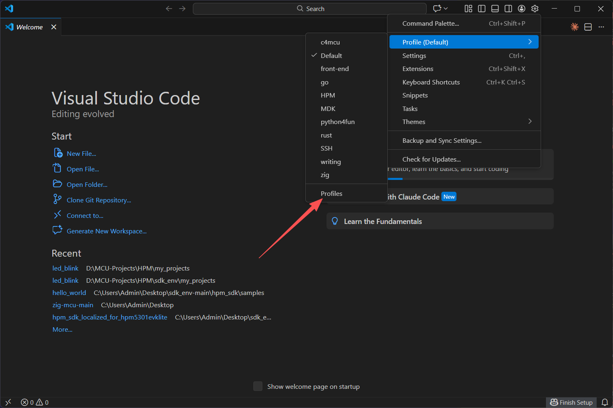
---

- 点击`New Profile`。
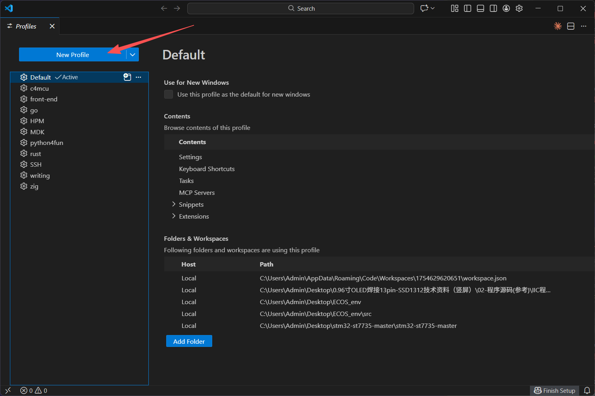
---

- 给`Profile`取名`HPM`。（图片中已有，只能用`HPM_TEST`）
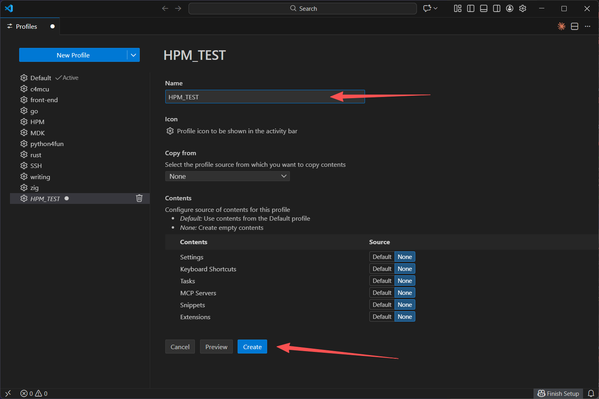
---
- 再次找到设置，点击`Profile`，选择刚创建的`HPM`。
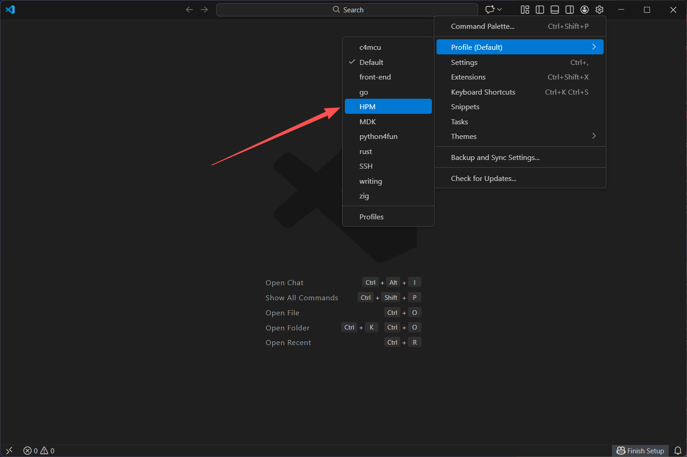

Step_10：在`VSCode`的`HPM`这个`Profile`里，下载插件，复制以下插件id到插件市场搜索安装即可。

- llvm-vs-code-extensions.vscode-clangd
- marus25.cortex-debug

Step_11：使用`VSCode`打开工程，添加配置文件，提供完整的代码提示、跳转等功能。

- 在工程根目录下，新建`.vscode`目录。将以下配置文件保存到这个目录里，按照注释取名即可。
- 配置文件的作用会在视频里讲解，只观看文字教程可能会略显吃力。
  - `.vscode`
```json
{
    // launch.json
    "version": "0.2.0",
    "configurations": [
        {
            "cwd": "${workspaceRoot}",
            "executable": "build/output/demo.elf",
            "name": "Debug with OpenOCD",
            "request": "launch",
            "type": "cortex-debug",
            "servertype": "openocd",
            "configFiles": [
                "probes/cmsis_dap.cfg",
                "soc/hpm5301.cfg",
                "boards/hpm5301evklite.cfg"
            ],
            "searchDir": [
                "D:/MCU-Projects/HPM/my_projects/led_blink/board/openocd"
            ],
            "runToEntryPoint": "main",
            "showDevDebugOutput": "none",
            "gdbPath": "D:/MCU-Projects/HPM/sdk_env_official/toolchains/rv32imac_zicsr_zifencei_multilib_b_ext-win/bin/riscv32-unknown-elf-gdb.exe",
            "serverpath": "D:/MCU-Projects/HPM/my_projects/led_blink/board/openocd/bin/openocd.exe",
            "svdFile": "D:/MCU-Projects/HPM/sdk_env_official/hpm_sdk/soc/HPM5300/HPM5301/HPM5301_svd.xml"
        }

    ]
}

```

```json
{
    //settings.json
    "clangd.arguments": [
        "--log=verbose",
        "--compile-commands-dir=D:/MCU-Projects/HPM/my_projects/led_blink/build",
        "--query-driver=D:/MCU-Projects/HPM/sdk_env/sdk_env_official/toolchains/rv32imac_zicsr_zifencei_multilib_b_ext-win/bin/riscv32-unknown-elf-*",
        "--header-insertion-decorators",
        "--all-scopes-completion",
        "--completion-style=detailed"
    ],
    "editor.quickSuggestions": {
        "other": true,
        "comments": false,
        "strings": true
    },
    "[c]": {
        "editor.quickSuggestions": {
            "other": true,
            "comments": false,
            "strings": true
        }
    }
}
```
继续将以下三个文件放到根目录。
  - `compile.sh`
    - 一般来说会取名为`build.sh`，但是考虑到还有个`build`目录，在按`Tab`补全的时候就会卡手，所以这里取名为`compile.sh`，你也可以在生成工程的时候，将`build`换成`output`等，名不重要，内容才重要。
```bash
#!/bin/bash
# 进入目录
cd build
# 开始编译，32可以自由更改
ninja -j 32
```
  - `flash.sh`
    - 将编译好的固件，通过`openocd`下载到板子上。
```bash
#!/bin/bash

OPENOCD_PATH="D:/MCU-Projects/HPM/my_projects/led_blink/board/openocd/bin/openocd.exe"
OPENOCD_SEARCH_PATH="D:/MCU-Projects/HPM/my_projects/led_blink/board/openocd"
ELF_FILE="D:/MCU-Projects/HPM/my_projects/led_blink/build/output/demo.elf"


"$OPENOCD_PATH" -s "$OPENOCD_SEARCH_PATH" \
  -f probes/cmsis_dap.cfg \
  -f soc/hpm5301.cfg \
  -f boards/hpm5301evklite.cfg \
  -c 'program "'"$ELF_FILE"'" verify; reset_soc; shutdown'
```
---

  - `.clangd`
    - 配置`clangd`
```yaml
# .clangd，放在根目录即可
# 1. 头文件提示/补全相关配置
Completion:
  AllScopes: Yes
  ArgumentLists: FullPlaceholders
  HeaderInsertion: IWYU       # 启用智能头文件插入和提示
  CodePatterns: All

# 2. 诊断规则
Diagnostics:
  UnusedIncludes: None        # 关闭"未使用头文件"提示

# 3. 索引配置
Index:
  Background: Build           # 后台索引所有文件，提升补全速度

# 4. 编译标志
CompileFlags:
  Add:
    - -ID:/MCU-Projects/HPM/sdk_env_official/toolchains/rv32imac_zicsr_zifencei_multilib_b_ext-win/lib/gcc/riscv32-unknown-elf/13.2.0/include
    - -ID:/MCU-Projects/HPM/sdk_env_official/toolchains/rv32imac_zicsr_zifencei_multilib_b_ext-win/riscv32-unknown-elf/include


```
## 效果演示

- 代码编写
  - 看视频演示即可
---

- 代码编译
  - 在终端里执行`./compile.sh`
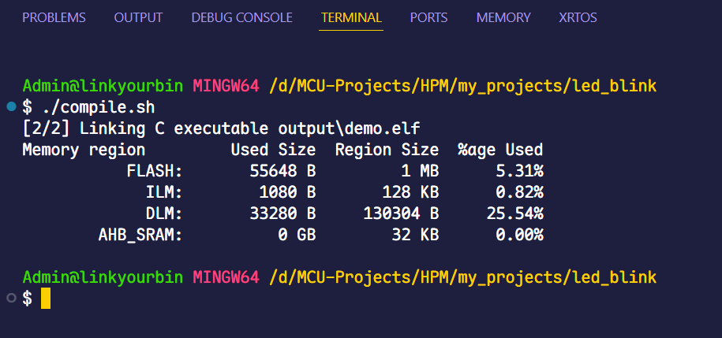
---
- 代码烧录
  - 在终端里执行`./flash.sh`
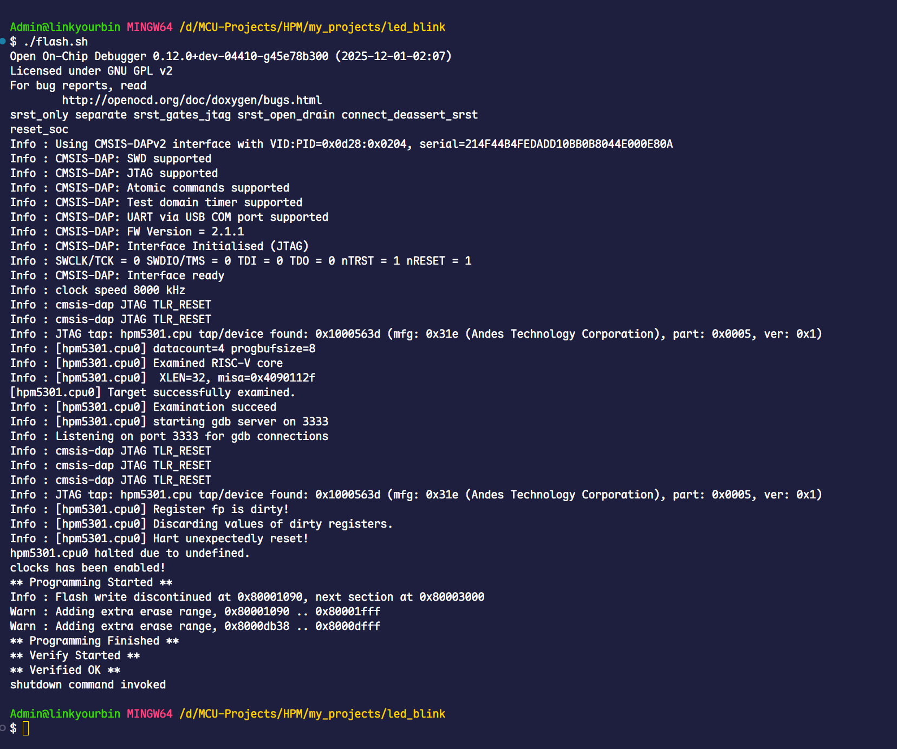
---
- 代码调试
  - 启动调试即可，快捷键为`F5`，`live watch`也测试正常。
  - 全局、局部变量均能正常`watch`。
  - 调用栈。
  - 寄存器。
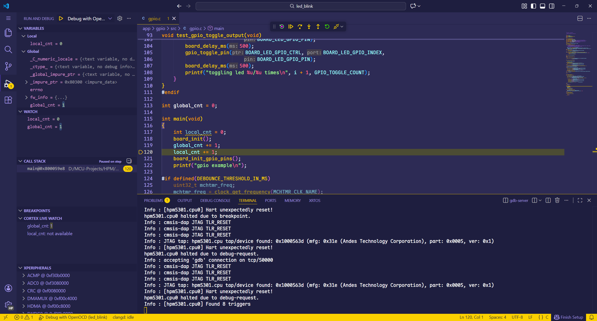

---

## 结语

教程到这里就算完结了。

希望能提高你的开发体验。

对于更加细腻的开发和更专业的开发，可以多关注官方的教程、文档，也需要结合自身的环境考虑，你所在的公司、团队等。

相关链接/参考：

- [HPM官网](https://www.hpmicro.com/)
- [HPM_sdk_env](https://github.com/hpmicro/sdk_env)


## TX_个人补充: 如果还是编译报错的话
1:在VSCode界面按下 Ctrl + Shift + P 组合键
Restart language 随后单击图片内即可
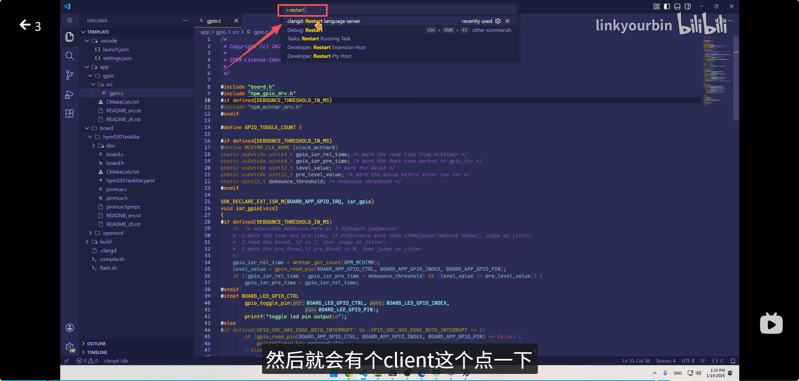
2:在Github上安装VSCode终端需要的bash插件 == git(这块可以问AI补充一下)
随后还需要在VSCode的设置里面将终端给更换一下
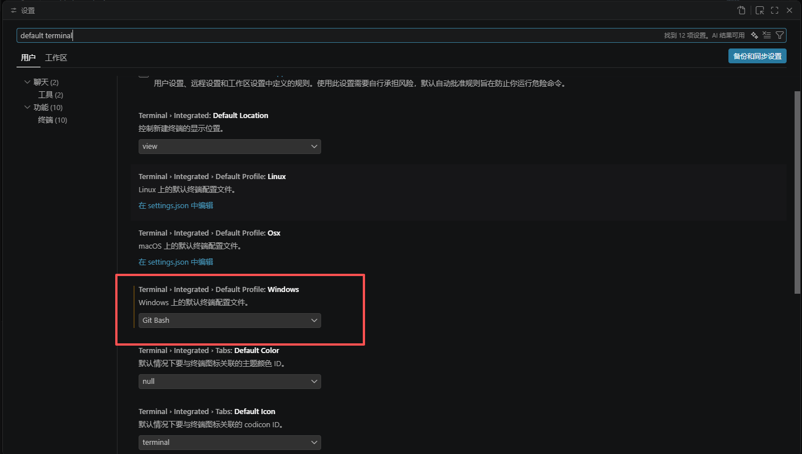